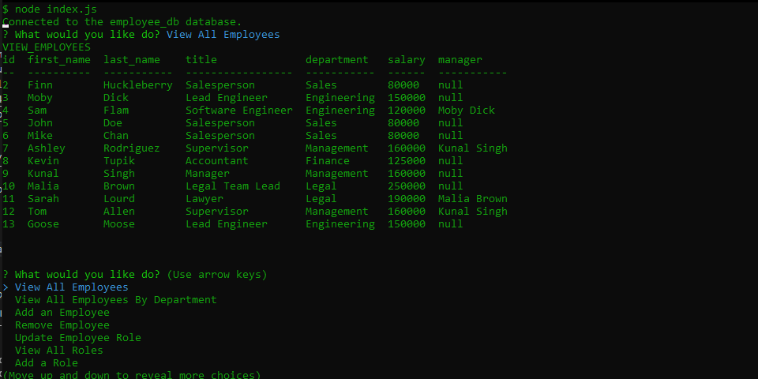

# Employee-Tracker

<br />



## Description
Usig [Mysql2 package](https://www.npmjs.com/package/mysql2), [Inquirer package](https://www.npmjs.com/package/inquirer), and [console.table package](https://www.npmjs.com/package/console.table) I have created an application where the user can have a nice friendly Command-Line UI that organize's sql query data into a nice table. Also allowing the user to manage over their ``` employee_db ```

## Table of Contents
  - [Description](#description)
  - [Installation](#installation)
  - [Usage](#usage)
  - [License](#license)
  - [Contributing](#contributing)
  - [Tests](#tests)
  - [Questions](#questions)

## Installation
First you will need to have [MySQL Server](https://dev.mysql.com/downloads/mysql/) installed on ur computer. After downloading just run...

    npm install

    //then run
    node index.js

  ## Usage
  Our goal was to make an app that had a easy to use UI that ran in the terminal, that allows the user to manager their `employee_db`
  Here is an example [video1](https://drive.google.com/file/d/1mV74pIAjgIe4XND4If9TR682-8ugFIRT/view), [video2](https://drive.google.com/file/d/1EDWokil4pNuBPotkfL5KI5acDsgYTHZH/view)

  ## License
  
    <br />
    This application is covered by the MIT license. 
    

  ## Contributing
  Gustavo Muratalla

  ## Tests
  Watch my video to see an example of our application [video1](https://drive.google.com/file/d/1mV74pIAjgIe4XND4If9TR682-8ugFIRT/view), [video2](https://drive.google.com/file/d/1EDWokil4pNuBPotkfL5KI5acDsgYTHZH/view)

  ## Questions
  U can always open a github issues prompt from our github repo<br />
  <br />
  :octocat: Find me on GitHub: [Teku-Guy](https://github.com/Teku-Guy)<br />
  <br />
  Email me with any questions: gusmuratalla@gmail.com<br /><br />

  